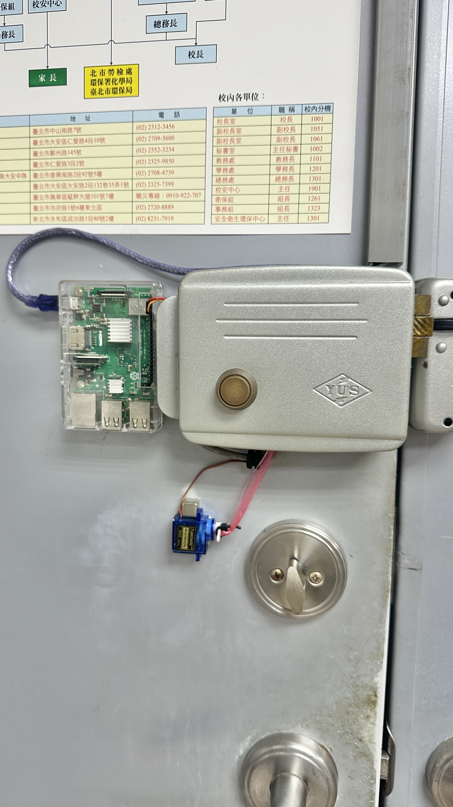
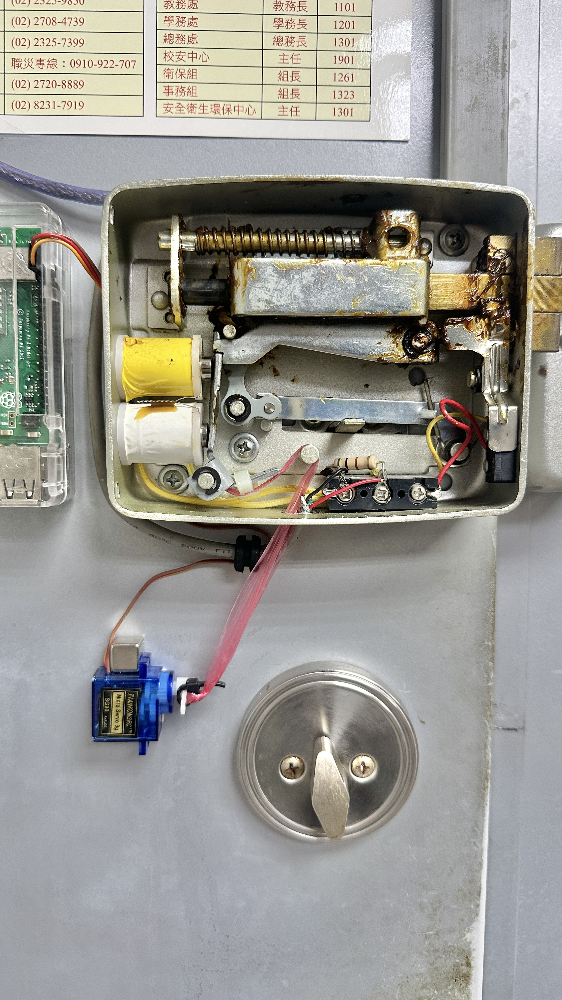
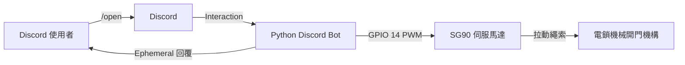

# Raspberry Pi Discord 智慧門鎖

這個專案使用 Raspberry Pi 3B+、Discord Bot 與 SG90 伺服馬達，透過拉動傳統電鎖的機械開門機構來完成遠端解鎖。它不修改原本的讀卡機控制線路；使用者在 Discord 輸入 `/open` 後，樹莓派控制 SG90 拉動繩索，短暫解鎖後再回到待機位置。

> [!WARNING]
> 這是會實際控制門鎖的裝置。只應安裝在你有權管理的門上，且不得影響消防逃生、室內機械開門、原讀卡機或鑰匙的正常功能。接線與調整機構前，請先關閉樹莓派及伺服馬達電源。

## 成果展示



Raspberry Pi 3B+ 固定於電鎖旁，SG90 以繩索連接開門機構。



打開外蓋後可看到繩索與電鎖內部連桿的連接位置。繩索必須避開彈簧、電磁線圈、鎖舌與其他移動零件。

## 系統架構



Discord Bot 由 Raspberry Pi 主動連線到 Discord，不需要替 Bot 開放 Web Server 或設定路由器連入埠。SSH 僅用於管理樹莓派，不應把 SSH 位址、帳號或密碼寫進公開儲存庫。

## 實機驗證環境

以下版本與參數已在 2026 年 9 月 4 日核對：

| 項目 | 實機設定 |
| --- | --- |
| 主控板 | Raspberry Pi 3B+ |
| 作業系統 | Raspberry Pi OS Lite 64-bit，Debian 13 Trixie base |
| Python | 3.13.5 |
| Discord 函式庫 | `discord.py 2.7.1` |
| GPIO 函式庫 | `gpiozero 2.0.1`、`rpi-lgpio 0.6` |
| 伺服馬達訊號 | BCM GPIO 14，實體 Pin 8 |
| 角度範圍 | 0° 至 90° |
| 待機角度 | 0° |
| 開鎖角度 | 37° |
| 拉動時間 | 0.5 秒 |
| Discord 指令 | `/open`，使用 Ephemeral 私人回覆 |
| 背景服務 | `doorbot.service`，開機自動啟動 |

拉伸角度與時間取決於 SG90 固定位置、搖臂長度、繩索鬆緊及電鎖機構。請從較小角度開始測試。

## 準備材料

- Raspberry Pi 3B+ 與穩定的 5V 電源
- 16 GB 以上的 microSD 卡與讀卡機
- SG90 伺服馬達
- 獨立穩壓 5V 電源，建議供 SG90 使用
- 杜邦線或合適的伺服馬達延長線
- 不易伸長的細繩，例如 PE 釣魚線
- 伺服馬達固定座、束帶或適合安裝面的固定材料
- 選配 10 kΩ 下拉電阻，用於減少開機時的訊號浮動
- 可使用 Discord Developer Portal 的 Discord 帳號

## GPIO 接線

### 推薦接法

| SG90 線材 | 連接位置 | 說明 |
| --- | --- | --- |
| 訊號線，通常為橘色或黃色 | Raspberry Pi GPIO 14，實體 Pin 8 | 3.3V PWM 控制訊號 |
| 5V，通常為紅色 | 獨立 5V 電源正極 | 不要接到 GPIO 訊號腳 |
| GND，通常為棕色或黑色 | 獨立電源負極，並接 Raspberry Pi GND | 外部電源與樹莓派必須共地 |

SG90 啟動或受阻時的瞬間電流可能讓樹莓派低電壓、降頻或重新啟動。長期部署建議讓 SG90 使用獨立 5V 電源，並與樹莓派共地。

### 展示機的三腳直插配置

展示機為了縮短線材，使用同一列的實體 Pin 4、Pin 6、Pin 8：

```text
Pin 4  -> 5V
Pin 6  -> GND
Pin 8  -> GPIO 14 訊號
```

標準 SG90 三腳接頭通常是「訊號、5V、GND」，與樹莓派這三支排針的「5V、GND、訊號」順序不同。不可直接插入。若採用此配置，必須先斷電，將端子重新排列為 5V、GND、訊號，並使用 `pinout` 再次確認實體腳位。

直接從樹莓派 5V Pin 為 SG90 供電只適合經量測確認的低負載原型。若出現低電壓、馬達異常、樹莓派降頻或重啟，請立刻改用獨立 5V 電源。

## 安裝機械結構

1. 在未接電的狀態下，用手確認電鎖內哪一支連桿會在按下開門鈕時移動。
2. 將繩索固定在該連桿上，確認拉動方向與原本按鈕相同。
3. 安裝 SG90，使繩索在待機角度略微放鬆，且不會卡住鎖舌或其他機構。
4. 暫時不要鎖緊搖臂與繩索。先完成無負載測試與小角度測試，再逐步調整。
5. 測試室內開門鈕、鑰匙及原讀卡機，確認 SG90 失去電源時仍可正常開門。

不要讓伺服馬達在終點持續頂住機構。程式在每次動作後呼叫 `detach()`，避免持續輸出 PWM 造成發熱與異音。

## 安裝 Raspberry Pi OS

1. 安裝並開啟 [Raspberry Pi Imager](https://www.raspberrypi.com/software/)。
2. 選擇 Raspberry Pi 3、Raspberry Pi OS Lite 64-bit 與目標 microSD 卡。
3. 在 OS Customisation 中設定：
   - 主機名稱，例如 `door-server`
   - 管理者使用者名稱與強密碼
   - Wi-Fi SSID、密碼及正確的國家或地區
   - 時區與鍵盤配置
   - 啟用 SSH；正式環境建議使用 SSH 公鑰驗證
4. 寫入並驗證 microSD 卡，插入 Raspberry Pi 後開機。
5. 從同一網路的電腦連線：

```bash
ssh <PI_USER>@<PI_HOST>
```

若你自行更改 SSH 連接埠：

```bash
ssh -p <SSH_PORT> <PI_USER>@<PI_HOST>
```

## 關閉 GPIO 14 的序列埠功能

GPIO 14 同時是 UART TX 腳位。若序列主控台仍在開機時輸出資料，SG90 可能把資料波形誤判成控制訊號而亂轉。

執行：

```bash
sudo raspi-config
```

進入 `Interface Options` 的 `Serial Port`，對下列兩個問題都選擇 `No`：

1. 是否允許透過序列埠登入。
2. 是否啟用序列埠硬體。

完成後重新啟動：

```bash
sudo reboot
```

重新登入後檢查：

```bash
grep -o 'console=serial[^ ]*' /boot/firmware/cmdline.txt
grep '^enable_uart' /boot/firmware/config.txt
```

第一個指令不應輸出任何內容，第二個應顯示 `enable_uart=0`。若開機瞬間仍會輕微抖動，可在 GPIO 14 訊號與 GND 之間加裝 10 kΩ 下拉電阻。

## 建立 Discord Bot

1. 前往 [Discord Developer Portal](https://discord.com/developers/applications)，建立 New Application。
2. 進入 Bot 頁面建立 Bot，產生 Token 並立即安全保存。
3. 不要把 Token 貼到程式碼、README、截圖、對話紀錄或 Git commit。
4. 本專案使用 Slash Command，不需要開啟 Message Content Intent、Presence Intent 或 Server Members Intent。
5. 在 Installation 或 OAuth2 URL Generator 中加入 `bot` 與 `applications.commands` scope。
6. 只授予必要的伺服器權限，例如 View Channels 與 Send Messages，然後把 Bot 安裝到指定的 Discord 伺服器。

接著在 Discord 使用者設定的 Advanced 頁面開啟 Developer Mode，對目標伺服器按右鍵並複製 Server ID。這個 Guild ID 會讓程式只把 `/open` 註冊到指定伺服器，通常也能更快看到更新後的指令。

Bot 安裝完成後，由伺服器管理員設定開門權限：

1. 進入 `Server Settings` > `Integrations`。
2. 找到這個 Bot，按下 `Manage`。
3. 在整個應用程式或 `/open` 指令的權限中，設定允許使用的身分組與頻道。
4. 若只允許特定身分組開門，可禁止 `@everyone`，再加入允許的實驗室身分組。
5. 在使用頻道確認該身分組具有 `Use Application Commands` 權限。

沒有權限的成員不會在指令選單中看到 `/open`。具有 Administrator 權限的成員不受一般指令限制，因此管理員身分組也應審慎分配。

## 安裝系統套件與 Python 環境

登入 Raspberry Pi 後執行：

```bash
sudo apt update
sudo apt install -y python3-pip python3-venv swig liblgpio-dev

mkdir -p ~/discord-door-bot
cd ~/discord-door-bot
python3 -m venv .venv
source .venv/bin/activate

python -m pip install --upgrade pip
python -m pip install discord.py gpiozero rpi-lgpio
```

`rpi-lgpio` 與 `RPi.GPIO` 會提供相同的 `RPi.GPIO` 模組名稱，不可安裝在同一個虛擬環境。若新建立的 `.venv` 中意外已有 `RPi.GPIO`，先移除再重裝：

```bash
python -m pip uninstall RPi.GPIO
python -m pip install --force-reinstall rpi-lgpio
```

## 建立 Bot 程式

在 `~/discord-door-bot/door_bot.py` 建立下列內容：

```python
import asyncio
import os

import discord
from discord.ext import commands
from gpiozero import AngularServo


TOKEN = os.environ["DISCORD_BOT_TOKEN"]
GUILD_ID = int(os.environ["DISCORD_GUILD_ID"])

SERVO_PIN = 14
REST_ANGLE = 0
OPEN_ANGLE = 37
OPEN_SECONDS = 0.5
RETURN_SECONDS = 0.5

GUILD = discord.Object(id=GUILD_ID)
servo = AngularServo(
    SERVO_PIN,
    min_angle=0,
    max_angle=90,
    initial_angle=None,
)
servo_lock = asyncio.Lock()


async def park_servo() -> None:
    servo.angle = REST_ANGLE
    await asyncio.sleep(RETURN_SECONDS)
    servo.detach()


class DoorBot(commands.Bot):
    async def setup_hook(self) -> None:
        await self.tree.sync(guild=GUILD)
        await park_servo()


intents = discord.Intents.default()
bot = DoorBot(command_prefix=commands.when_mentioned, intents=intents)


@bot.event
async def on_ready() -> None:
    print(f"已登入為 {bot.user}")


@bot.tree.command(
    name="open",
    description="解鎖實驗室門禁",
    guild=GUILD,
)
async def open_door(interaction: discord.Interaction) -> None:
    if servo_lock.locked():
        await interaction.response.send_message(
            "門鎖正在執行上一個指令，請稍候再試。",
            ephemeral=True,
        )
        return

    await interaction.response.send_message(
        "收到指令，正在解鎖。",
        ephemeral=True,
    )

    async with servo_lock:
        try:
            servo.angle = OPEN_ANGLE
            await asyncio.sleep(OPEN_SECONDS)
            servo.angle = REST_ANGLE
            await asyncio.sleep(RETURN_SECONDS)
        except Exception:
            await interaction.followup.send(
                "伺服馬達控制失敗，請聯絡管理者。",
                ephemeral=True,
            )
            raise
        finally:
            servo.detach()

    await interaction.followup.send("已解鎖。", ephemeral=True)


bot.run(TOKEN)
```

## 設定憑證

用目前登入的 Raspberry Pi 使用者建立僅本人可讀的設定檔：

```bash
mkdir -p ~/.config/discord-door-bot
chmod 700 ~/.config/discord-door-bot
nano ~/.config/discord-door-bot/env
```

在設定檔中輸入以下內容：

```ini
DISCORD_BOT_TOKEN=你的BotToken
DISCORD_GUILD_ID=伺服器ID
```

儲存後限制檔案權限：

```bash
chmod 600 ~/.config/discord-door-bot/env
```

> [!WARNING]
> 任何曾經貼到對話、文件或 Git 的 Token 都應視為已外洩。請在 Discord Developer Portal 重置，不要繼續使用舊 Token。

## 首次測試與角度校正

先不要連接繩索，載入環境變數後手動執行：

```bash
cd ~/discord-door-bot
set -a
source ~/.config/discord-door-bot/env
set +a
.venv/bin/python door_bot.py
```

在指定的 Discord 伺服器輸入 `/open`。確認 Bot 私下回覆、SG90 由待機角度轉到開鎖角度，再回到待機角度。

按 `Ctrl+C` 停止程式，逐步調整：

```python
REST_ANGLE = 0
OPEN_ANGLE = 37
OPEN_SECONDS = 0.5
```

建議每次只增加或減少 5° 至 10°。先測空載，再鬆鬆地接上繩索，最後才固定。若馬達發出持續異音、卡在終點、繩索過緊或樹莓派重新啟動，應立即斷電並調整機構或供電。

## 建立 systemd 開機服務

查詢目前使用者名稱：

```bash
whoami
```

建立服務檔：

```bash
sudo nano /etc/systemd/system/doorbot.service
```

貼上下列內容，將每一個 `<PI_USER>` 換成 `whoami` 顯示的使用者名稱：

```ini
[Unit]
Description=Discord Door Bot Service
After=network-online.target
Wants=network-online.target

[Service]
Type=simple
User=<PI_USER>
Group=<PI_USER>
SupplementaryGroups=gpio
WorkingDirectory=/home/<PI_USER>/discord-door-bot
EnvironmentFile=/home/<PI_USER>/.config/discord-door-bot/env
Environment=PYTHONUNBUFFERED=1
ExecStart=/home/<PI_USER>/discord-door-bot/.venv/bin/python /home/<PI_USER>/discord-door-bot/door_bot.py
Restart=always
RestartSec=10
UMask=0077

[Install]
WantedBy=multi-user.target
```

載入、啟用並啟動服務：

```bash
sudo systemctl daemon-reload
sudo systemctl enable --now doorbot.service
```

檢查服務：

```bash
sudo systemctl status doorbot.service
```

看到 `active (running)` 後，再到 Discord 測試 `/open`。重新啟動 Raspberry Pi，確認 Bot 會自行上線，而且 SG90 不會在開機過程亂轉。

## 日常維護

修改程式後重新啟動：

```bash
sudo systemctl restart doorbot.service
sudo systemctl status doorbot.service
```

持續查看日誌：

```bash
sudo journalctl -u doorbot.service -f
```

停止或再次啟動：

```bash
sudo systemctl stop doorbot.service
sudo systemctl start doorbot.service
```

## 故障排除

### Discord 看不到 `/open`

- 確認 Bot 已安裝到 `DISCORD_GUILD_ID` 指定的伺服器。
- 確認安裝時包含 `applications.commands` scope。
- 重新啟動 `doorbot.service`，查看日誌是否顯示登入或同步錯誤。
- 完全關閉並重新開啟 Discord App，以重新載入指令清單。

### Discord 顯示沒有權限

- 請伺服器管理員開啟 `Server Settings` > `Integrations`，檢查 Bot 或 `/open` 的身分組與頻道權限。
- 確認使用者在目前頻道具有 `Use Application Commands` 權限。
- 若剛修改權限，完全關閉並重新開啟 Discord App，再查看指令選單。

### 無法存取 GPIO

檢查目前使用者群組：

```bash
groups
ls -l /dev/gpiochip*
```

使用者應屬於 `gpio` 群組。若不是：

```bash
sudo usermod -aG gpio <PI_USER>
sudo reboot
```

### 安裝 `rpi-lgpio` 時找不到 `swig`

```bash
sudo apt install -y swig
source ~/discord-door-bot/.venv/bin/activate
python -m pip install --force-reinstall rpi-lgpio
```

### 安裝時出現 `cannot find -llgpio`

```bash
sudo apt install -y liblgpio-dev
source ~/discord-door-bot/.venv/bin/activate
python -m pip install --force-reinstall rpi-lgpio
```

### SG90 在開機時亂轉

- 確認 GPIO 14 的序列登入與 UART 硬體都已關閉。
- 在 GPIO 14 與 GND 之間加裝 10 kΩ 下拉電阻。
- 確認訊號、5V、GND 沒有插錯或接觸不良。
- 改用獨立 5V 電源，並與樹莓派共地。

### 執行 `/open` 時樹莓派重啟

這通常是 SG90 啟動造成瞬間壓降。不要繼續反覆測試；先將 SG90 改接獨立 5V 電源，確認共地，再檢查 `vcgencmd get_throttled`。

### 服務執行的不是最新程式

確認 systemd 使用的檔案路徑：

```bash
systemctl cat doorbot.service
sudo systemctl restart doorbot.service
sudo journalctl -u doorbot.service -n 50 --no-pager
```

## 參考文件

- [Raspberry Pi 官方安裝與設定說明](https://www.raspberrypi.com/documentation/computers/getting-started.html)
- [Raspberry Pi 官方 UART 與 GPIO 設定](https://www.raspberrypi.com/documentation/computers/configuration.html)
- [Raspberry Pi 官方 GPIO 規格](https://www.raspberrypi.com/documentation/computers/raspberry-pi.html)
- [Discord Application Commands 官方文件](https://docs.discord.com/developers/interactions/application-commands)
- [discord.py Interactions API](https://discordpy.readthedocs.io/en/stable/interactions/api.html)
- [GPIO Zero AngularServo 文件](https://gpiozero.readthedocs.io/en/latest/api_output.html#angularservo)
- [rpi-lgpio 安裝文件](https://rpi-lgpio.readthedocs.io/en/latest/install.html)
